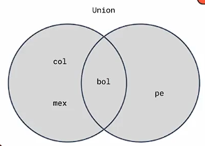

# **Comprehensions, Funciones y Manejo de Errores**

Fortalece tus habilidades de programación con Python, uno de los lenguajes más utilizados. Aprende conceptos como funciones, comprehensions, errores y manejo de archivos que elevarán tu nivel al programar. Crea un gran proyecto junto a tu profesor Nicolas Molina.

> Indice <a id="i"></a>

1. # Introducción

* 01. ## [El Zen de Python](#01)

2. # Conjuntos

* 02. ## [Sets](#02)
* 03. ## [Modificando conjuntos](#03)
* 04. ## [Operaciones con conjuntos](#04)
* 05. ## [Playgrounds: elimina elementos duplicados usando conjuntos](#05)

3. # Comprehensions

* 06. ## [List Comprehension](#06)
* 07. ## [Dictionary Comprehension](#07)
* 08. ## [Dictionary Comprehension: condition](#08)
* 09. ## [Playgrounds: crea una lista usando list comprehension](#09)
* 10. ## [Lists vs. Tuples vs. Sets](#10)

4. # Funciones

* 11. ## [Funciones](#11)
* 12. ## [Funciones: return](#12)
* 13. ## [Parámetros por defecto y múltiples returns](#13)
* 14. ## [El scope](#14)
* 15. ## [Refactor game](#15)
* 16. ## [Playgrounds: tienda de tecnología](#16)
* 17. ## [Funciones anónimas: lambda](#17)
* 18. ## [Higher order function: una función dentro de otra función](#18)
* 19. ## [Map](#19)
* 20. ## [Map con diccionarios](#20)
* 21. ## [Reto: map con inmutabilidad](#21)
* 22. ## [Playgrounds: multiplica todos los elementos por dos](#22)
* 23. ## [Filter](#23)
* 24. ## [Playgrounds: retorna solo palabras de 4 letras y más](#24)
* 25. ## [Reduce](#25)

5. # Módulos

* 26. ## [Módulos](#26)
* 27. ## [Mis propios módulos](#27)
* 28. ## [Módulos como scripts: __name__ y __main__](#28)
* 29. ## [Paquetes](#29)
* 30. ## [Playgrounds: calcular la suma de todas las compras](#30)

6. # Manipulación de archivos y errores

* 31. ## [Iterables](#31)
* 32. ## [Errores en Python](#32)
* 33. ## [Manejo de excepciones](#33)
* 34. ## [Playgrounds: captura la excepción: zerodivisionerror](#34)
* 35. ## [Leer un archivo de texto](#35)
* 36. ## [Escribir en un archivo](#36)
* 37. ## [Leer un CSV](#37)
* 38. ## [Playgrounds: lee un csv para calcular el total de gastos](#38)

7. # Gráficas en Python

* 39. ## [Creando una gráfica](#39)
* 40. ## [Reto: graficando la población de un país](#40)
* 41. ## [Reto: graficando la población mundial](#41)

8. # Próximos pasos

* 42. ## [¡Conoce otros proyectos de este curso!](#42)
* 43. ## [Reconoce tu proceso y certifícate](#43)
* 44. ## [Toma el Curso de PIP y Entornos Virtuales con Python](#44)

> Fin del indice

1. # Introducción

* 01. ## El Zen de Python <a id="01"></a>

import this --> da como resultado La Esencia de Python

The Zen of Python, by Tim Peters

Beautiful is better than ugly.
Explicit is better than implicit.
Simple is better than complex.
Complex is better than complicated.
Flat is better than nested.
Sparse is better than dense.
Readability counts.
Special cases aren't special enough to break the rules.
Although practicality beats purity.
Errors should never pass silently.
Unless explicitly silenced.
In the face of ambiguity, refuse the temptation to guess.
There should be one-- and preferably only one --obvious way to do it.
Although that way may not be obvious at first unless you're Dutch.
Now is better than never.
Although never is often better than *right* now.
If the implementation is hard to explain, it's a bad idea.
If the implementation is easy to explain, it may be a good idea.
Namespaces are one honking great idea -- let's do more of those!

[Volver al indice](#i)


2. # Conjuntos

* 02. ## Sets <a id="02"></a>


* Se pueden modificar.
* No tienen un orden.
* No permite duplicados.

````py
#Conjuntos:

# Se pueden modificar
# No tienen un orden
# No permite duplicados
set_countries = {'col','mex','bol','col'}
# En esta definicion se eliminara automaticamente el ultimo elemento porque es duplicado

print(set_countries)
print(type(set_countries))

set_types = { 1 , "hola", False, 12.12, }

print(set_types)

# Podemos definir conjuntos a partir de otras estructuras de datos

# Crea un conjunto de caracteres
set_from_string = set('hola')

print(set_from_string)

set_from_tuples = set(('abc', 'cbv', 'as', 'abc'))

print(set_from_tuples)

numbers = [1,2,3,1,2,3,4]

set_from_list = set(numbers)

print(set_from_list)

unique_numbers = list(set_from_list)

print(unique_numbers)
````

[Volver al indice](#i)

* 03. ## Modificando conjuntos <a id="03"></a>

````py
set_countries = {'col','mex','bol'}

set_countries_size = len(set_countries)

print(set_countries_size) #3

print('col' in set_countries) # True
print('pe' in set_countries) # False

# add

set_countries.add('pe')
print(set_countries)

# update
set_countries.update({'ar','ecua','pe'})
print(set_countries)

# remove

set_countries.remove('col')
print(set_countries)

# Intentar remover un elemento que no existe retorna KeyError
# set_countries.remove('arg') 

# Este metodo no lanza error si no encuentra el elemento
set_countries.discard('arg')

# clear

set_countries.clear()
print(set_countries)
print(len(set_countries))
````

[Volver al indice](#i)

* 04. ## Operaciones con conjuntos <a id="04"></a>




````py
set_a = {'col','mex','bol'}
set_b = {'pe','bol'}

# union

set_c = set_a.union(set_b)
print(set_c)

# | --> operador de union
print(set_a | set_b) 

# intersection

set_c = set_a.intersection(set_b)

print(set_c)

# & --> operador de interseccion
print(set_a & set_b)


# difference

set_c = set_a.difference(set_b)
print(set_c)

# - --> operador de diferencia
print(set_a - set_b)

# symmtric difference

set_c = set_a.symmetric_difference(set_b)
print(set_c)

# ^ --> operador de diferencia simetrica
print(set_a ^ set_b)
````

[Volver al indice](#i)

* 05. ## Playgrounds: elimina elementos duplicados usando conjuntos <a id="05"></a>

[Volver al indice](#i)

3. # Comprehensions

* 06. ## List Comprehension <a id="06"></a>


[Volver al indice](#i)

* 07. ## Dictionary Comprehension <a id="07"></a>


[Volver al indice](#i)

* 08. ## Dictionary Comprehension: condition <a id="08"></a>

````py
import random
countries = ['col', 'mex', 'bol', 'pe']

population = { country: random.randint(1e5,1e7) for country in countries }
print(f'Population: {population}')

result = {country: population for (country,population) in population.items() if population > 5e6}
print(f'Countries with population larger than 5000000: {result}')
````

[Volver al indice](#i)

* 09. ## Playgrounds: crea una lista usando list comprehension <a id="09"></a>

[Volver al indice](#i)

* 10. ## Lists vs. Tuples vs. Sets <a id="10"></a>


[Volver al indice](#i)

4. # Funciones

* 11. ## Funciones <a id="11"></a>

````py
# asi se define una función en python
def sum(a,b):
    print(a+b)

a = 2
b = 4
#ejecutamos la funcion
sum(a,b)
````

[Volver al indice](#i)

* 12. ## Funciones: return <a id="12"></a>


[Volver al indice](#i)

* 13. ## Parámetros por defecto y múltiples returns <a id="13"></a>

```py
def find_volume(length = 1, width = 0, depth = 0):
    return length * width * depth, width, 'Hola' # retorna una tupla con los 3 valores

volume = find_volume(width=10)[0]
volume, width, text = find_volume(width=10)

print(volume)
```

[Volver al indice](#i)

* 14. ## El scope <a id="14"></a>


[Volver al indice](#i)

* 15. ## Refactor game <a id="15"></a>

[Volver al indice](#i)

* 16. ## Playgrounds: tienda de tecnología <a id="16"></a>

[Volver al indice](#i)

* 17. ## Funciones anónimas: lambda <a id="17"></a>


````python
def increment(x):
    return x + 1

l_increment = lambda x : x + 1

result = l_increment(0)
print(result) # 1

full_name = lambda name, last_name : f'Full name is: {name.title()} {last_name.title()}'

print(full_name('Mateo','Ryhr Uranga'))
````

[Volver al indice](#i)

* 18. ## Higher order function: una función dentro de otra función <a id="18"></a>

Una high order function es una función que recibe otra función como parámetro y la usa en su funcionalidad.

````python
def increment(x):
    return x + 1

l_increment = lambda x : x + 1

def high_order_function(x,func):
    return x + func(x)

l_hof = lambda x, func : x + func(x)

result = high_order_function(2,increment)
print(result) # 5

result = l_hof(2,l_increment)
print(result) # 5
````

[Volver al indice](#i)

* 19. ## Map <a id="19"></a>


La función principal de la función map es hacer transformaciones de datos.


    map(food => food.cook())


[Volver al indice](#i)

* 20. ## Map con diccionarios <a id="20"></a>

````py
import pprint

items = [
    {
        'product': 'camisa',
        'price': 100
    },
    {
        'product': 'pantalones',
        'price': 300
    },
    {
        'product': 'pantalones jean',
        'price': 200
    },
]
pprint.pprint(f'Items original: {items}')

prices = list(map(lambda item : item['price'],items))
pprint.pprint(f'Price list: {prices}')

def add_taxes_property(item, tax_rate):
    item['taxes'] = item['price'] * tax_rate #is modifying the original item
    return item

items_with_taxes = list(map(add_taxes_property,items,[.19]*len(items)))
pprint.pprint(f'Items with taxes: {items_with_taxes}', sort_dicts=True, indent=0, width=80,compact=False)

pprint.pprint(f'Original Items: {items}', sort_dicts=True, indent=0, width=80,compact=False)

````

[Volver al indice](#i)

* 21. ## Reto: map con inmutabilidad <a id="21"></a>

````py
# Mutabilidad e inmutabilidad
# Estas propiedades describen si un campo o variable se va a modificar si operamos con ella
# Depende de si al operar con ella se hace una copia, o sea que se usa otra direccion de memoria

# Depende de cada lenguaje, en Python:
#  los datos primitivos son inmutables (int, float, bool, string, Unicode, and tuple)
#  el resto son mutables, por lo que sus asignaciones NO SON DE COPIA, SE ASIGNA LA REFERENCIA EN MEMORIA 

items = [
    {
        'product': 'camisa',
        'price': 100
    },
    {
        'product': 'pantalones',
        'price': 300
    },
    {
        'product': 'pantalones jean',
        'price': 200
    },
]

def add_taxes_property(item, tax_rate):
    # Next line will modify the item
    # item['taxes'] = item['price'] * tax_rate 
    # Next we will avoid mutability
    newItem = item.copy()
    newItem['taxes'] = newItem['price'] * tax_rate 
    return newItem

items_with_taxes = list(
  map(
        add_taxes_property, items, [.19] * len(items)
    )
  )
print(f'Items with taxes: \n{items_with_taxes}')

print(f'Original Items: \n{items}')
````

[Volver al indice](#i)

* 22. ## Playgrounds: multiplica todos los elementos por dos <a id="22"></a>


[Volver al indice](#i)

* 23. ## Filter <a id="23"></a>

Filtra una colección dejando solo los valores que cumplan una condición.

````py
numbers = [1,2,3,4,5]
new_numbers = list(filter(lambda x : x, numbers))

print(new_numbers)
````

[Volver al indice](#i)

* 24. ## Playgrounds: retorna solo palabras de 4 letras y más <a id="24"></a>


[Volver al indice](#i)

* 25. ## Reduce <a id="25"></a>

Reduce una colección a un solo valor.

la función reduce se encuentra en la librería functools, hay que importarla

Por ejemplo, el siguiente código reduce la lista [1, 2, 3, 4] al número 10 aplicando la función accum(counter, item), que retorna la suma de sus argumentos.

````py
import functools #importamos reduce

def accum(counter, item):
	return counter + item

print(reduce(accum, [1, 2, 3, 4]))#10
````

Reduce(fun, seq) tiene dos parametros:

1. Una función particular a aplicar a todos los elementos de una secuencia
2. Una secuencia de elementos.

Como funciona:

* Primero toma los dos primeros elementos de la secuencia y aplica la función particular.
* Toma el resultado anterior y a este valor mas el siguiente elemento de la secuencia le aplica la función particular.
* El proceso continua hasta que no tiene mas elementos.
* Retorna el resultado.

[Volver al indice](#i)

5. # Módulos

* 26. ## Módulos <a id="26"></a>

¿Se imaginan todo el software escrito en un archivo? Seria imposible.

Por eso se dividen en varios archivos o módulos, y se usan cuando sean necesarios.

Por ejemplo, para crear un juego el archivo principal que inicia el juego podría llamarse game.py, este se encarga de iniciar el juego e invocar el resto de modulos según sea necesario, que podrían ser:
    * config.py --> un modulo para configuraciones
    * player.py --> un modulo para el jugador
        * move.py --> que a su vez llama otro móodulo encargado del movimiento
    * enemigo_melee.py
        * move.py --> aca reutilizamos un módulo

Un módulo es un archivo que contiene definiciones y declaraciones de Python. El nombre del archivo es el nombre del módulo con el sufijo .py adjunto. Dentro de un módulo, el nombre del módulo (como una cadena) está disponible como el valor de la variable global __name__

Las definiciones de un módulo se pueden importar a otros módulos con la instrucción: *import module_name as abreviation(optional)*

https://docs.python.org/3/tutorial/modules.html

[Volver al indice](#i)

* 27. ## Mis propios módulos <a id="27"></a>

[Volver al indice](#i)

* 28. ## Módulos como scripts: __name__ y __main__ <a id="28"></a>

````py
# Este if dice que si es ejecutado desde la terminal, entre al run y si es ejecutado desde otro archivo, no se ejecuta.
if __name__ == '__main__':
    run()
# Esto es conocido como Entrypoint
````

Los modulos tienen una dualidad de ser ejecutados desde terminal o ser ejecutados al hacer import, por eso el codigo debe estar encapsulado en funciones para que no se ejecuten al hacer import desde otro archivo.

[Volver al indice](#i)

* 29. ## Paquetes <a id="29"></a>

Podemos importar un paquete en Python.
Un paquete es una carpeta que contiene varios módulos.

Antes de la versión 3.3 de Python, los paquetes deben llevar un  archivo __init__.py

Es una buena práctica crear este archivo e importar todos los móduclos del paquete aquí, asi al importar el paquete importamos todos los módulos.

````py
# Para importar un paquete:
import package_name # --> importa el __init__.py del paquete
# Para importar un módulo de un paquete
from package_name import module_name
````

[Volver al indice](#i)

* 30. ## Playgrounds: calcular la suma de todas las compras <a id="30"></a>


[Volver al indice](#i)


6. # Manipulación de archivos y errores

* 31. ## Iterables <a id="31"></a>

https://docs.python.org/3/c-api/iterator.html

````py
# Una iteración que se repetira 10 veces
for i in range(1,10):
    print(i)

# La ventaja de un iterador es que podemos controlar la manera en que se ejecuta
# * Podemos generar iteraciones manualmente
# * * Usamos la instrucción next() 
my_iterator = iter(range(1,3))
print(my_iterator)
print(next(my_iterator))
print(next(my_iterator))
print(next(my_iterator)) # Genera la excepción StopIteration, porque alcanza el limite
````

[Volver al indice](#i)

* 32. ## Errores en Python <a id="32"></a>

https://docs.python.org/3.12/reference/executionmodel.html#exceptions

````py
# Las excepciones detienen el flujo de ejecución a menos que las capturemos y controlemos.

# print(0/0) # ZeroDivisionError

def sum(x,y):
    return x + y

assert sum(2,2) == 4 # assetion error --> used to do unitTesting TDD

# Puedes lanzar tus propias excepciones para por ejemplo que se respete la logica de negocio
age = 10
if age < 18:
    raise Exception('No se permiten menores de edad')
````

[Volver al indice](#i)

* 33. ## Manejo de excepciones <a id="33"></a>

https://docs.python.org/3/tutorial/errors.html

````py
try: # Intentamos una acción que esperamos puede generar cierto error
    print(0 / 0)
except ZeroDivisionError as error: # Capturamos la excepción
    print(error) # Damos una respuesta
else: # se ejecuta cuando el bloque ‘try’ se ejecuta correctamente, sin excepciones
    pass
finally: # finalmente se ejecuta este bloque
    pass
````

[Volver al indice](#i)

* 34. ## Playgrounds: captura la excepción: zerodivisionerror <a id="34"></a>

[Volver al indice](#i)

* 35. ## Leer un archivo de texto <a id="35"></a>

````py
import os
# Obtenemos la ruta absoluta desde la ruta relativa
file_path = os.path.abspath('./files/text.txt')
print(file_path)

# open method --> open file and return a stream (TextIOWrapper)
# esto ocupará espacio en memoria
file = open(file_path)

print(file.read()) # read method return a str from a TextIOWrapper

print(file.readline())
print(file.readline())

for line in file:
    print(line)

# Para liberar el espacio en memoria lo cerramos
file.close()

# el bloque with cerrará automaticamente el archivo una vez ejecutadas las instrucciones
with open(file_path) as file:
    for line in file:
        print(line)
````

[Volver al indice](#i)

* 36. ## Escribir en un archivo <a id="36"></a>

````py
import os
path_file = f'{os.path.dirname(__file__)}./files/text.txt'

print(path_file)
# 'r+' permiso de lectura y escritura
with open(path_file, 'r+') as file:
    for line in file:
        print(line)
    # Escribir en un archivo
    file.write('\nNuevas cosas en el archivo:\n')
    file.write('\nUna linea\n')
    file.write('\nOtra linea mas\n')
````

[Volver al indice](#i)

* 37. ## Leer un CSV <a id="37"></a>

````py
def read_csv(path):
    with open(path, 'r') as csvfile:
        # instanciamos un lector de csv, delimitador --> caracter que separa los datos (suele ser ',' o ';')
        reader = csv.reader(csvfile,delimiter = ',')
        header = next(reader)
        data = []
        for row in reader:
            iterable = zip(header,row)
            country_dict = {key: value for key, value in iterable}
            data.append(country_dict)
        return data
````

[Volver al indice](#i)

* 38. ## Playgrounds: lee un csv para calcular el total de gastos <a id="38"></a>

[Volver al indice](#i)


7. # Gráficas en Python

* 39. ## Creando una gráfica <a id="39"></a>

Para instalar librería primero tenemos que crear un **entorno virtual**, para instalar las dependencias de forma local y no global, para asi aislar los paquetes de próximos proyectos que creemos.

1. Instalamos el módulo **virtualenv** para crear entornos virtuales. Esto queda instalado de forma global, por lo que lo podemos usar para iniciar un entorno virtual en todos los proyectos. 

        pip install virtualenv

2. Luego en la carpeta del proyecto creamos la carpeta del entorno virtual con el comando de virtualenv

        python -m virtualenv venv
        # venv es la carpeta del entorno virtual

3. Activamos el entorno virtual

        # en linux
        ./venv/Scripts/activate

        # en windows
        .\venv\Scripts\activate

4. En VSC seleccionamos el interprete del entorno virtual para Python
    1. F1
    2. Python: Select Interpreter
    3. El que diga ('venv': venv)

Para graficar usaremos la librería matplotlib

        pip install matplotlib

````py
import matplotlib.pyplot as plt

def generate_bar_chart(labels, values):
    # ax --> coordenadas donde empezamos a graficar
    fig, ax = plt.subplots()
    ax.bar(labels,values)
    plt.show();

def generate_pie_chart(labels,values):
    fig, ax = plt.subplots()
    ax.pie(values,labels=labels)
    ax.axis('equal')
    plt.show();


if __name__ == '__main__':
    labels = ['a','b','c']
    values = [100,200,300]
    # generate_bar_chart(labels,values)
    generate_pie_chart(labels,values)
````

[Volver al indice](#i)

* 40. ## Reto: graficando la población de un país <a id="40"></a>


[Volver al indice](#i)

* 41. ## Reto: graficando la población mundial <a id="41"></a>


[Volver al indice](#i)


8. # Próximos pasos

* 42. ## ¡Conoce otros proyectos de este curso! <a id="42"></a>


[Volver al indice](#i)

* 43. ## Reconoce tu proceso y certifícate <a id="43"></a>


[Volver al indice](#i)

* 44. ## Toma el Curso de PIP y Entornos Virtuales con Python <a id="44"></a>


[Volver al indice](#i)
